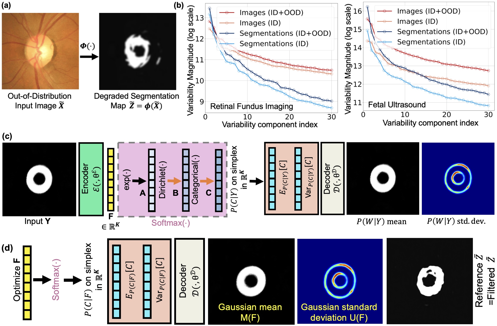

# VarDeepPCA: Sampling-Free Variational Deep Learning for OOD Medical Image Segmentation

A lightweight, variational deep neural network framework designed to restore and refine degraded segmentation maps in out-of-distribution (OOD) medical images by leveraging intrinsic geometric priors.



## Overview

Deep neural networks (DNNs) frequently fail when encountering medical images from different scanners or acquisition protocols. VarDeepPCA addresses this critical challenge without requiring target-domain data or extensive retraining by:

- **Learning valid anatomical geometries** using only small in-distribution datasets
- **Providing uncertainty estimates** alongside refined segmentation maps
- **Enabling efficient, sampling-free inference** through a novel variational framework
- **Improving anatomical plausibility** while reducing errors on OOD data

### Key Features

✓ **No target-domain data required** – Works with only small ID datasets  
✓ **Uncertainty quantification** – Provides confidence estimates for predictions  
✓ **Computationally efficient** – Sampling-free learning and inference  
✓ **Anatomically aware** – Explicitly models distribution of valid geometries  
✓ **Lightweight plugin** – Can refine outputs from existing segmentation models  

## Methodology

VarDeepPCA introduces a **reinterpretation of the softmax mapping** that enables:

1. **Implicit distribution modeling** of valid anatomical segmentation maps
2. **Exact distributional learning** without sampling overhead
3. **Seamless integration** with existing segmentation pipelines as a post-processing refinement step
4. **Uncertainty estimation** through variational inference

The framework explicitly learns the geometric constraints and variations present in annotated in-distribution training data, enabling it to restore anatomically plausible segmentations even when presented with OOD images.

## Experimental Validation

For detailed experimental results and analysis, please refer to the papers listed below.

### Clinical Applications

VarDeepPCA has been validated across **4 distinct clinical applications** using **14 publicly available datasets**:

- **Cardiac imaging**: Myocardium segmentation
- **Ophthalmology**: Neuroretinal rim segmentation  
- **Urology**: Prostate segmentation
- **Obstetrics**: Fetal head segmentation

### Performance

Comprehensive comparisons against **15 existing methods** demonstrate that VarDeepPCA:

- Significantly improves anatomical plausibility of segmentation geometries
- Enhances clinical utility of segmentations on OOD data
- Reduces errors without requiring additional training data
- Provides meaningful uncertainty estimates for clinical decision support


### 📄 Papers

- **[MELBA 2026 Journal Publication](papers/melba_vardeep.pdf)** - Learning a Sampling-Free Variational DNN Plugin from Tiny Training Sets to Refine OOD Segmentation With Uncertainty Estimation
  - Authors: Jimut B. Pal, Suyash P. Awate
  - Journal: Machine Learning for Biomedical Imaging
  - Volume: 2026, Issue: June 2026
  - Pages: 327–358
  - DOI: https://doi.org/10.59275/j.melba.2026-6d54

- **[WACV 2025 Conference Paper](papers/shape_prior_wacv_24.pdf)** - Reviving Poor Object Segmentations in OOD Medical Images using Variational-Deep-PCA Modeling on Segmentation Maps with Sampling-Free Learning
  - Authors: Jimut B. Pal, Shantanu Welling, Himali Saini, Suyash P. Awate
  - Proceedings: Winter Conference on Applications of Computer Vision (WACV)
  - Month: February 2025
  - Pages: 9346–9355

### 🎤 Presentations

- **[MELBA Conference Slides](slides/melba_vardeep_slide.pdf)** - Presentation slides from the MELBA 2026 conference

## Citation

If you use VarDeepPCA in your research, please cite:

### WACV 2025 Publication
```bibtex
@InProceedings{Pal_2025_WACV,
    author    = {Pal, Jimut B. and Welling, Shantanu and Saini, Himali and Awate, Suyash P.},
    title     = {Reviving Poor Object Segmentations in OOD Medical Images using Variational-Deep-PCA Modeling on Segmentation Maps with Sampling-Free Learning},
    booktitle = {Proceedings of the Winter Conference on Applications of Computer Vision (WACV)},
    month     = {February},
    year      = {2025},
    pages     = {9346-9355}
}
```

### MELBA 2026 Journal Publication
```bibtex
@article{melba:2026:017:pal,
    title = "Learning a Sampling-Free Variational DNN Plugin from Tiny Training Sets to Refine OOD Segmentation With Uncertainty Estimation",
    author = "Pal, Jimut B. and Awate, Suyash P.",
    journal = "Machine Learning for Biomedical Imaging",
    volume = "2026",
    issue = "June 2026 issue",
    year = "2026",
    pages = "327--358",
    issn = "2766-905X",
    doi = "https://doi.org/10.59275/j.melba.2026-6d54",
    url = "https://melba-journal.org/2026:017"
}
```

## Application Areas

### When to Use VarDeepPCA

- Your segmentation model performs poorly on images from new scanners or protocols
- You need uncertainty estimates alongside segmentation predictions
- You have limited labeled data in the target domain
- You want to improve anatomical plausibility without retraining from scratch
- You're working with medical images across multiple acquisition settings

### Supported Medical Imaging Tasks

- Cardiac segmentation
- Retinal structure segmentation
- Prostate segmentation
- Fetal anatomy segmentation
- Other anatomically-constrained medical image segmentation problems

## Technical Highlights

### Theoretical Innovation
- Novel variational learning framework via softmax reinterpretation
- Exact distribution modeling without sampling
- Computational efficiency through sampling-free inference

### Practical Advantages
- **Lightweight**: Acts as a refinement plugin for existing models
- **Data-efficient**: Learns from only small ID training sets
- **Generalizable**: Consistent improvements across diverse medical applications
- **Interpretable**: Provides uncertainty estimates for clinical validation


---

**Authors**: Jimut B. Pal, Suyash P. Awate (with contributions from Shantanu Welling, Himali Saini)

**Last Updated**: July 2026
